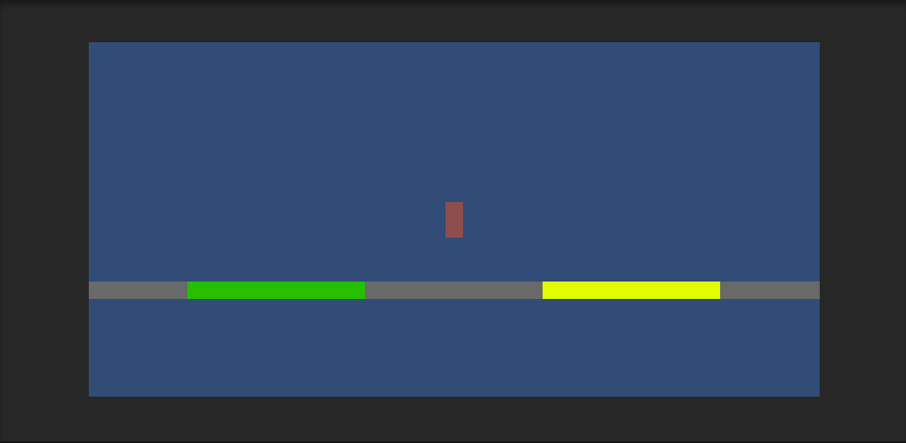
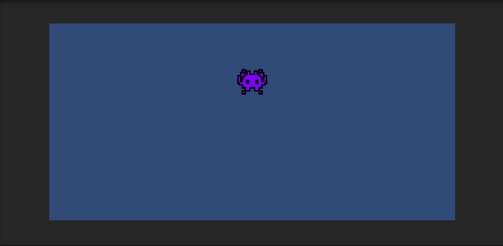
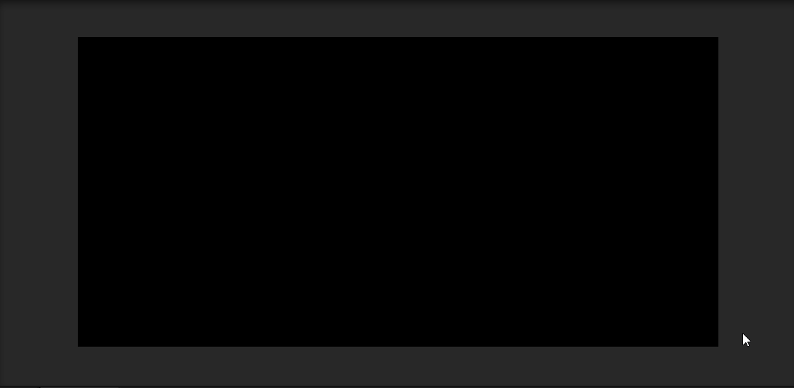
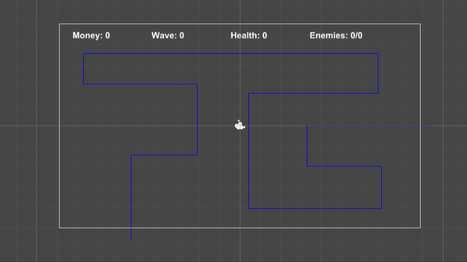
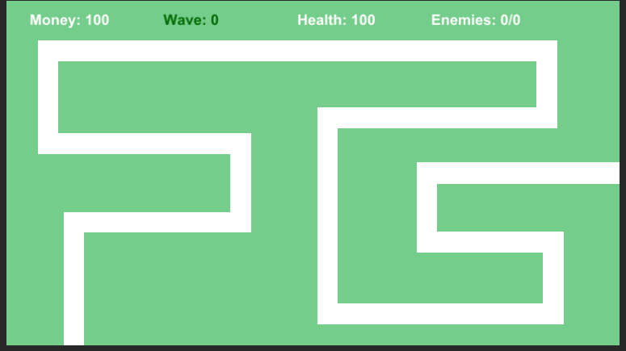
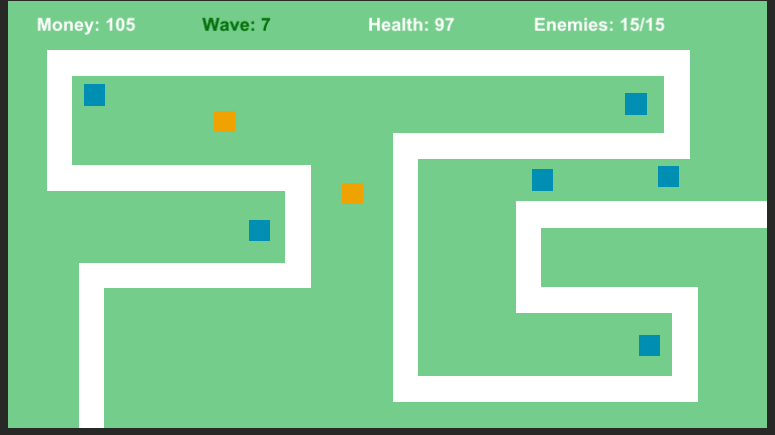

# unity-system-testing

## Table Of Contents
* [Overview](#overview)
* [Platformer](#platformer-test)
* [Shader Test 01](#shader-test-01)
* [Shader Test 02](#shader-test-02)
* [Dialogue Test](#dialogue-test)
* [Tower Defence](#tower-defence)

## Overview
Before starting my final game project for college later this year, I wanted to create different mini-levels in Unity, each of them intending to test my ability to create a certain feature. One level may have a specific type of combat, one level may have a dialogue system, etc.

An additional reason for this project is just to test some more advanced systems on their own, before potentially implementing them into actual projects. I am not overly proficient with Unity so I wanted to learn some more complex parts of the tool.

## Platformer Test

#### Player Movement

Having not used Unity for quite some time, I wanted to start with a very basic project to refresh my mind. While it is only a small script, implementing the basic movement helped me remember the C# syntax. I kept using '#' for comments, instead of using '//'.

#### Booster Pads
To challenge myself a bit further, although still very simple, I added two new types of ground. One makes the player run faster, the other makes the player jump higher. I also added a small buffer so that you continue to run after leaving that platform. The buffer is smaller for the jump boost but it is still there.

#### Camera Movement
Although it is quite a basic concept, I have always struggled a bit with smooth camera movement. However, having created a game in another engine recently (GameMaker Studio 2), I applied the same logic to this project and it was a lot more simple than before.

#### Result

## Shader Test 01
I have never really though about using shaders in Unity before. In a recent venture into GameMaker Studio 2, I began to look into shaders a bit more (although never ended up using them). Shaders in GameMaker have their own scripting language, and I was expecting a similar thing in Unity. However, shaders in Unity are created in a shader graph, which is a lot easier to use than I originally thought. I created some basic gameplay and added a red flash when the player is hit, and a dissolve effect (ripped straight from a [Brackeys video](https://youtu.be/5dzGj9k8Qy8) when the player dies.

I did go a tad overboard with the shaders, and the gameplay and collisions are far from perfect. But the focus was learning how to setup up and create basic shaders, so I wasn't too worried about perfection.

#### Result

## Shader Test 02

I had a lot of fun making the first shader test. However, I had essentially copied the process from a video and I wanted to try and make something on my own. I was a bit stuck for ideas though. I thought I would start with looking at what nodes are available in the shader graph and I stumbled onto a Voronoi, of which I was vaguely aware of. After fumbling around with the node graph I ended up deciding that I would just try to make a weird psychedelic visual thing. I wanted the texture to move and shift so I created a script. And to be honest, most of the time was spent developing the script and getting the values to shift smoothly but changing speed and direction. 

I eventually came up with something that I was happy with, but there are a few problems - mainly with the colours. The colour was intended to shift, similar to the position and angle. But as I was adding onto the R, G, & B values individually, they would all sort of move together. This resulting in the colour just shifting from white, to grey, to black, etc. And also, when the values reach 0, they just shift back to 255 which is quite jarring. But I had spent too much time on this section of the project so I decided to move on.

#### Results
  
With minimal tweaks, I can change the shader to get this result:

## Dialogue Test

A dialogue system is a key part of many different types of games. I created one last year, following along with a few different videos. But I wanted to attempt to make one completely on my own. So using Serializable Objects and a lengthy script, I managed to create one. Its fairly easy to set up, as you can create a Dialogue Object, which features the speakers name, the sentences they will speak, and then the available responses. Each response points to a new dialogue object, creating a dialogue chain.

Additional features include 'additional dialogues', which play after the dialogue has ended. This was meant to replicated going back to an NPC after talking to them. These additional dialouges can be applied after a dialogue object, or after responses.

I am very proud of this part of the project specifically because it is a fairly complicated system that I am happy I was able to create without much help from online. The script could certainly do with some refining and potentially splitting into two separate scripts, but I am still incredibly happy with the result.

#### Reuslt

## Tower Defence
This section of the project was, by far, the most initimidating for me. But it also ended up being the most rewarding, the one I am most proud of. Similar to the dialogue test, I had attempted to create a tower defence project over a year ago. But I got stuck at the first hurdle and lost all motivation (as was a pattern with a lot of my projects at the time). This attempt was the complete opposite. I sat down and wrote out the key mechanics of a tower defence (enemies following a path, building towers, attacking enemies in range, etc), then split them into smaller sections if I needed to. For each of those steps, I then planned out how I was going to implement it in detail. And thus it begun...  

### Enemies
The first step was getting enemies to spawn and follow a path. I wanted to have this path be easy to change. I created a 'Path Manager', which stores an array of objects. These objects would act as the corners of the path. The enemies would set the 1st object as their destination, and move towards it. Once they got there, they would select the next corner and repeat the process. To make it more visual, I used Unitys Gizmos functionality to draw lines between the corners. This meants that I could see the path in the scene editor.

For enemy movement, I created 'Wave' objects, which can be of any length. Each element in the wave contains the enemy type (red or green), and the time at which they should spawn. This allows you to easily change which enemies spawn, and the time they spawn at. Each enemy is spawned at the first point in the path, and they move towards the second. When they reach the end of the path, they get destroyed and do damage to the player. Different enemy types do different damage.

Much later down the line, I realised that the player should probably have a way of seeing the path in-game. Initially, I just looped through the array of path corners, and spawned a sprite between them. I then stretched them on the x or y axis to fill the gap. This worked, but only allowed for horizontal or vertical paths. While it's a rare case, I wanted to allow for diagonal paths. This took me a while to figure out, but I eventually change the system to make the sprite tall enough to fill the gap, and then just rotated it based on the angle.

### Towers
The next major mechanic in a tower defence game is building towers. I flicked between wanting to use a grid system, but eventually decided against it so that it felt more like Bloons Tower Defense. When the player presses escape, the game pauses and the shop UI appears. This was easy enough to do, and there are many resources for this. There are buttons, which you can click if you can afford the tower. When the object is created, it has a 'isPlaced' value which is set to false. While this value is false, the tower follows the mouse. When the player clicks, it checks if the current position is valid, and sets the 'isPlaced' value to true if its valid. There was a few different collision systems that I went through before deciding on the current one. The tower sends out four rays. If the right and left one both collide with a path corner, then it checks their ID (the index in the path). If the IDs are consecutive, then it means it is between two points, and therefore on the path.

The towers each have a range, speed, damage, and a number of other parameters. Each enemy also has a value, which is added to the players money when it is killed. The only major issue I had with the towers was the attacking. Seeing as the enemies are moving, I wanted the towers themselves to do the damage, and the bullet is only visual. This later proved as an issue because the enemies were dying as the bullet was fired, instead of when it got hit. To get around this, while still not using regular collision, I just made the bullet do the damage when it destroys itself (which is roughly when it is at the enemy)

### Other Gameplay
The only other feature I may want to add to the game is the ability to sell or upgrade towers. But seeing as this is only meant to be a test project, I thought it best not to go overboard with features.

There are a few graphic issues with the gif below, but these are an issue with the gif and are not present in the game.

